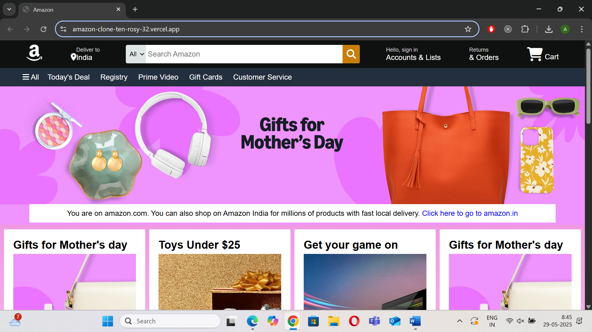
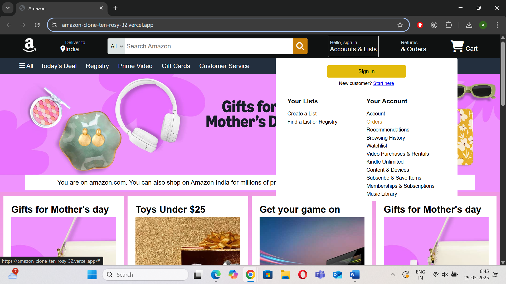
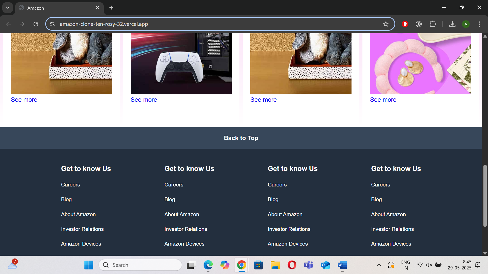

# Amazon UI Clone

A simple clone of Amazon's user interface built with **HTML** and **CSS** for learning and practice purposes.

---
## Live Demo

Check out the live demo here: [Demo](https://amazon-clone-ten-rosy-32.vercel.app/)

---
## Screenshots

---

## Project Overview

This project replicates the basic look and feel of Amazon's website UI. It includes key UI components such as:

- Responsive **Header** with logo, search bar, and navigation options  
- Functional **Dropdown menus**  
- Product **Cards** showcasing items  
- Clean **Footer** with relevant links  
- Usage of **CSS positioning** (`absolute`, `relative`, etc.) to achieve layout accuracy and UI polish

The goal of this project is to deepen my understanding of HTML and CSS layout techniques and practice building real-world inspired UI components.

---

## Features

- Dropdown menus for navigation  
- Search bar with styling similar to Amazon  
- Product cards with images, titles 
- Header and footer layout  
- Semantic and clean HTML structure  
- CSS Flexbox/Grid combined with positioning for layout control  

---

